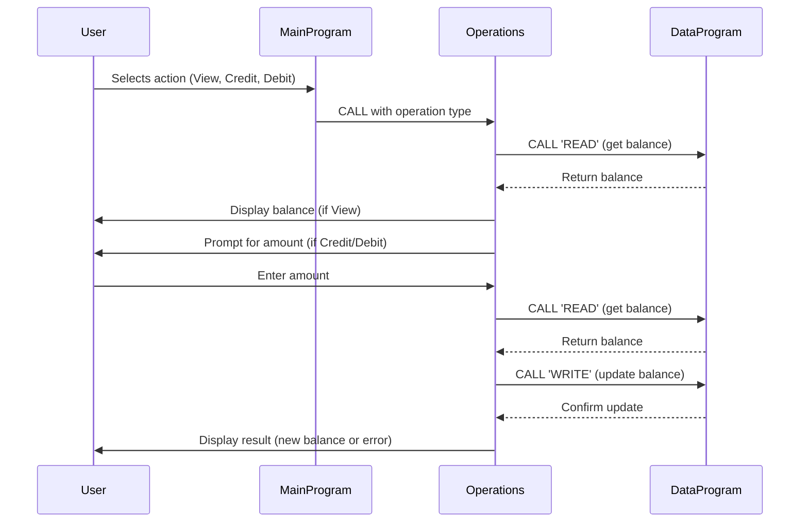

# COBOL Student Account Management System Documentation

This project demonstrates a simple account management system for student accounts, implemented in COBOL. The system allows users to view their balance, credit their account, and debit their account, with persistent balance storage.

## Purpose of Each COBOL File

### `main.cob`
- **Purpose:** Acts as the main entry point and user interface for the account management system.
- **Key Functions:**
  - Displays a menu for users to select actions: View Balance, Credit Account, Debit Account, or Exit.
  - Accepts user input and calls the appropriate operation in `operations.cob`.
- **Business Rules:**
  - Only accepts choices 1-4; displays an error for invalid input.
  - Continues running until the user chooses to exit.

### `operations.cob`
- **Purpose:** Handles the core business logic for account operations.
- **Key Functions:**
  - `TOTAL`: Reads and displays the current account balance.
  - `CREDIT`: Prompts for a credit amount, adds it to the balance, and updates storage.
  - `DEBIT`: Prompts for a debit amount, checks for sufficient funds, subtracts from the balance if possible, and updates storage.
- **Business Rules:**
  - Credit and debit operations require user input for the amount.
  - Debit operations check for sufficient funds before proceeding; if insufficient, an error message is displayed.
  - All balance updates are persisted via calls to `data.cob`.

### `data.cob`
- **Purpose:** Manages persistent storage of the account balance.
- **Key Functions:**
  - `READ`: Returns the current stored balance.
  - `WRITE`: Updates the stored balance with a new value.
- **Business Rules:**
  - Ensures that the balance is consistently stored and retrieved for all operations.

## Specific Business Rules for Student Accounts
- Initial balance is set to 1000.00.
- Only valid operations are allowed (view, credit, debit, exit).
- Debit operations cannot exceed the available balance; otherwise, the transaction is denied.
- All changes to the balance are immediately persisted.

---

For further details, see the source code in `/src/cobol/`.

---

## Sequence Diagram: Data Flow

